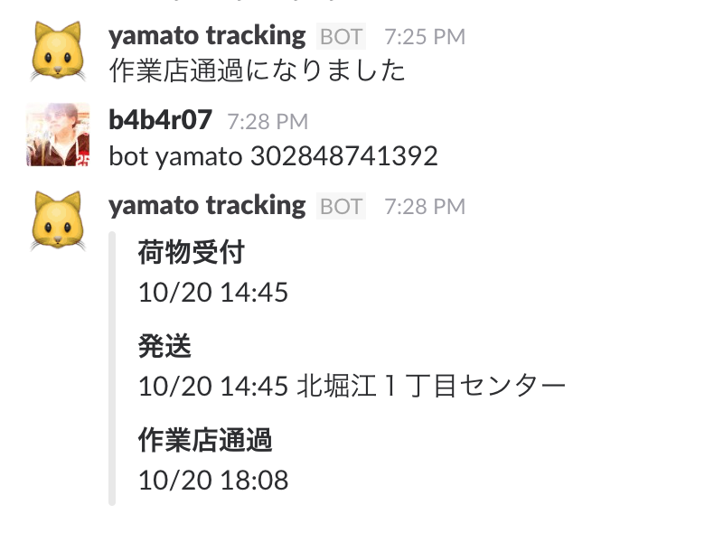
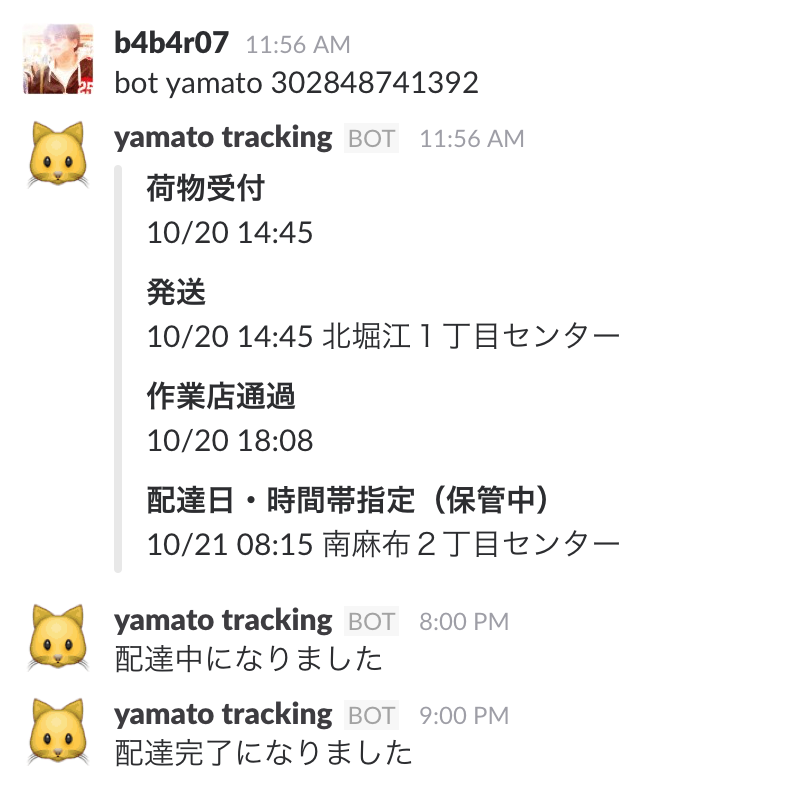

yamato-bot
===

クロネコヤマトの荷物配達を追跡します

## 使い方

初めてクローンした場合、`npm install` してください。

```
> bot yamato {伝票番号}
```

一度、コマンドを実行すると伝票番号とステータス（`荷物受付`、`発送`など）がキャッシュされ、ウォッチし続けます (cron)。ステータスが変わると通知してくれます。





## TODOs

- [ ] 複数の伝票番号に対応

## 謝辞、ライセンス

この bot では nanoblog さんによるヤマト運輸の配送状況を確認する API を使用しています。

- [[WebAPI]ヤマト運輸の配送状況を確認するAPIを作ってみた](http://nanoappli.com/blog/archives/603)
- [[YamaTrack]ヤマト運輸の荷物問合せサイトを作成しました](http://nanoappli.com/blog/archives/787)

@b4b4r07 [MIT](http://b4b4r07.mit-license.org)
